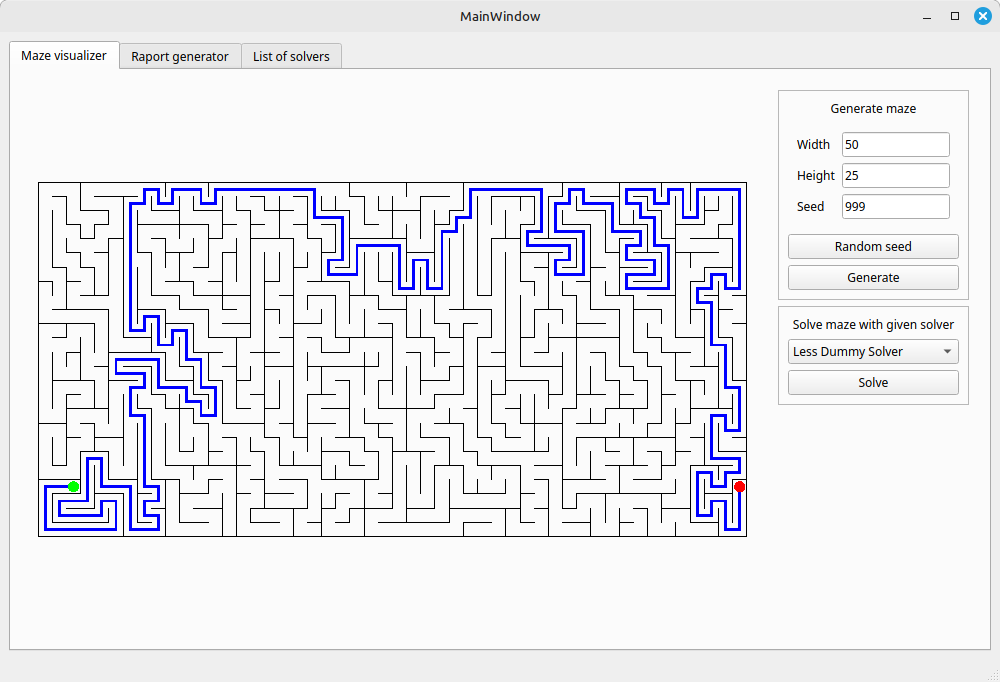
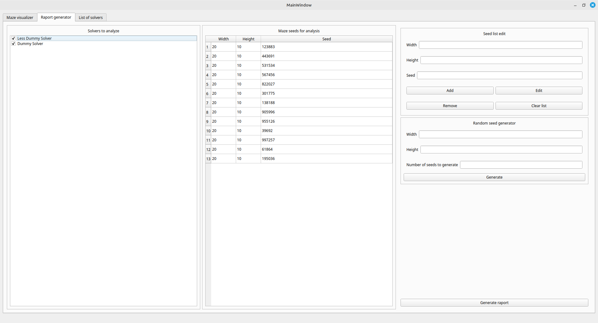
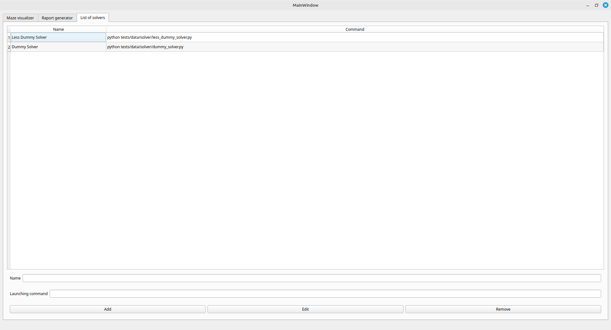

<a id="readme-top"></a>


<!-- HEADING -->
<br />
<div align="center">
  <h3 align="center">UnMazeLab</h3>
  <p align="center">
    App for testing maze solvers
    <br />
    <br />
    <a href="https://github.com/mszleger/unmazelab">View Repository</a>
    ·
    <a href="https://github.com/mszleger/unmazelab/issues/new?labels=bug&template=bug-report---.md">Report Bug</a>
    ·
    <a href="https://github.com/mszleger/unmazelab/issues/new?labels=enhancement&template=feature-request---.md">Request Feature</a>
  </p>
</div>


<!-- TABLE OF CONTENTS -->
<details>
  <summary>Table of Contents</summary>
  <ol>
    <li>
      <a href="#about-the-project">About The Project</a>
      <ul>
        <li><a href="#built-with">Built With</a></li>
      </ul>
    </li>
    <li>
      <a href="#getting-started">Getting Started</a>
      <ul>
        <li><a href="#prerequisites">Prerequisites</a></li>
        <li><a href="#installation">Installation</a></li>
      </ul>
    </li>
    <li><a href="#usage">Usage</a></li>
      <ul>
        <li><a href="#maze-visualizer">Maze visualizer</a></li>
        <li><a href="#raport-generator">Raport generator</a></li>
        <li><a href="#list-of-solvers">List of solvers</a></li>
      </ul>
    <li><a href="#roadmap">Roadmap</a></li>
    <li><a href="#contributing">Contributing</a></li>
    <li><a href="#license">License</a></li>
    <li><a href="#contact">Contact</a></li>
    <li><a href="#acknowledgments">Acknowledgments</a></li>
  </ol>
</details>


<!-- ABOUT THE PROJECT -->
## About The Project

UnMazeLab was designed and developed as part of a research project to investigate and compare the performance of different maze-solving algorithms.

The application's task is to:
* generate mazes,
* communicate with subprograms that generate maze solutions,
* generate raport as csv file showing time needed by each selected solver to solve each maze from given list of mazes,
* visualize generated mazes,
* visualize received maze solutions.

<p align="right">(<a href="#readme-top">back to top</a>)</p>


### Built With

* [Python][Python-url]
* [pytest][pytest-url]
* [PySide][PySide-url]
* [Qt][Qt-url]

<p align="right">(<a href="#readme-top">back to top</a>)</p>


<!-- GETTING STARTED -->
## Getting Started

To get a local copy up and running follow these simple example steps.

### Prerequisites

The only prerequisites needed for installation is conda. To install miniconda follow this [guide][Miniconda-install-guide].

### Installation

1. Clone project repository:
  ```sh
  git clone https://github.com/mszleger/unmazelab.git
  ```

2. Create conda environment using requirements.yml file:
  ```sh
  conda env create -n unmazelab -f unmazelab/requirements.yml
  ```

<p align="right">(<a href="#readme-top">back to top</a>)</p>


<!-- USAGE EXAMPLES -->
## Usage

To run app navigate to repository directory and activate conda environment:
  ```sh
  conda activate unmazelab
  ```

Run script `run.sh`:
  ```sh
  ./ run.sh
  ```

Application has three tabs:
* Maze visualizer
* Raport generator
* List of solvers

### Maze visualizer



Maze visualizer tab allows you to visualize maze and it's solution.
You can visualize maze by inputting width, height, seed and pressing `Generate` button.
You can generate random seed using `Random seed` button.
You can visualize solution of maze generated by solver selected from list under `Solve maze with given solver` label and pressing `Solve` button.

### Raport generator



Raport generator tab allows you to generate raport containing time needed by selected solvers to solve given mazes.
You can choose what solver you want to use while generating report by checking/unchecking boxes next to solvers' names under `Solvers to analyze` label (checked - will be tested, unchecked - won't be tested).
You can add maze to list of mazes to test on by inputting width, height, seed and pressing `Add` button.
You can edit maze from list of mazes to test on by inputting width, height, seed, selecting row to edit and pressing `Edit` button.
You can remove maze from list of mazes to test on by selecting row to remove and pressing `Remove` button.
You can remove all mazes from list of mazes to test on by pressing `Clear list` button.
You can generate given number of random mazes to list of mazes to test on by inputting width, height, number of seeds to generate and pressing `Generate` button.
You can generate raport of selected solvers on given list of mazes by pressing `Generate raport` button.

### List of solvers



List of solvers tab allows you to manage list of solvers added to application.
You can add solver to list by typing it's name representation, command running solver (e.g. python path-to-solver/solver.py) and pressing `Add` button.
You can edit solver from list by typing it's new name representation, new command running solver (e.g. python path-to-solver/solver.py), selecting row you want to edit and pressing `Edit` button.
You can remove solver from list by selecting row you want to remove and pressing `Remove` button.

<p align="right">(<a href="#readme-top">back to top</a>)</p>


<!-- ROADMAP -->
## Roadmap

- [x] Add README
- [ ] Add UML Class Diagram
- [ ] Refactor code to match google python style guide and class diagram
- [ ] Modify run script and call command function tests to run not only on Linux
- [ ] Fix GUI freezing during raport generating
- [ ] Add progress bar for raport generator
- [ ] Add exceptions handling in GUI (e.g. check if input fields aren't empty)

See the [open issues](https://github.com/mszleger/unmazelab/issues) for a full list of proposed features (and known issues).

<p align="right">(<a href="#readme-top">back to top</a>)</p>


<!-- CONTRIBUTING -->
## Contributing

If you have a suggestion that would make this better, please fork the repo and create a pull request. You can also simply open an issue with the tag "enhancement".

1. Fork the project
2. Create your feature branch (`git checkout -b feature/new-feature`)
3. Commit your changes (`git commit -m 'Add some new feature'`)
4. Push to the branch (`git push origin feature/new-feature`)
5. Open a pull request

<p align="right">(<a href="#readme-top">back to top</a>)</p>


<!-- LICENSE -->
## License

Distributed under the MIT License. See `LICENSE` for more information.

<p align="right">(<a href="#readme-top">back to top</a>)</p>


<!-- CONTACT -->
## Contact

Michał Szleger - michal.szleger@gmail.com

Project Link: [https://github.com/mszleger/unmazelab](https://github.com/mszleger/unmazelab)

<p align="right">(<a href="#readme-top">back to top</a>)</p>


<!-- ACKNOWLEDGMENTS -->
## Acknowledgments

* [Best README Template](https://github.com/othneildrew/Best-README-Template)
* [draw.io](https://www.drawio.com/)
* [Google Python Style Guide](https://google.github.io/styleguide/pyguide.html)

<p align="right">(<a href="#readme-top">back to top</a>)</p>


<!-- MARKDOWN LINKS & IMAGES -->
[Python-url]: https://www.python.org/
[pytest-url]: https://docs.pytest.org/en/stable/
[PySide-url]: https://wiki.qt.io/Qt_for_Python
[Qt-url]: https://www.qt.io/
[Miniconda-install-guide]: https://docs.anaconda.com/miniconda/install/